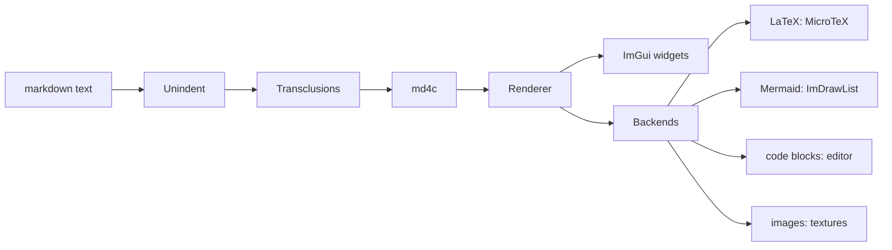
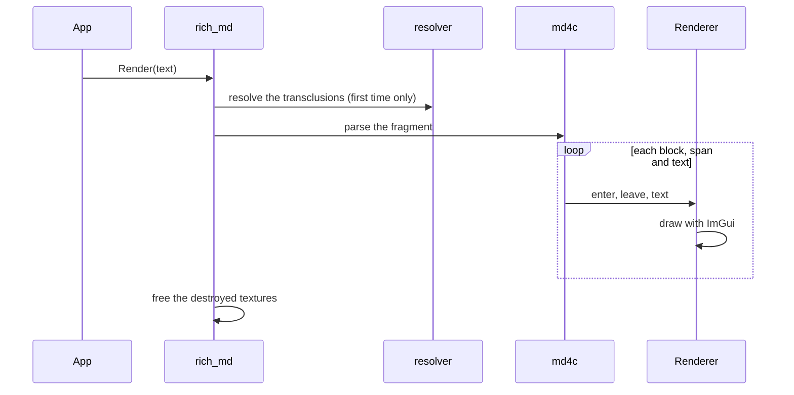
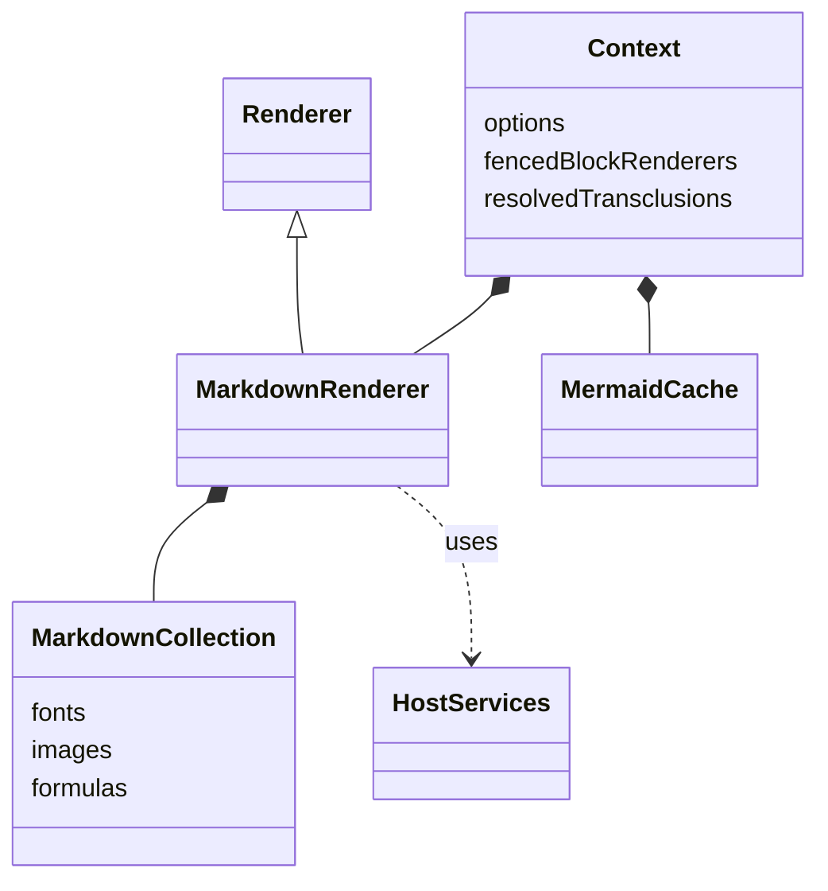
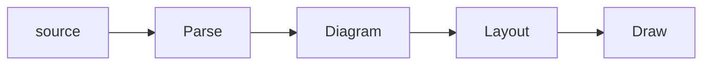
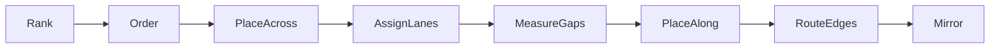

<!-- Generated from architecture.src.md by narrative_resolve: do not edit -->
# imgui_rich_md: architecture

How rich_md works, and how its Mermaid backend works, for contributors. Like the [API page](api.md), this page is
assembled from the sources by [narrative programming](narrative_programming/narrative_programming.md) (its source:
[architecture.src.md](architecture.src.md)): its prose and its code come from the files they describe.

## Part 1: how rich_md works

### The pipeline



Each `Render()` call renders a *fragment*: `Render()` removes its common indentation and resolves its
transclusions (once per text: the result is cached in the context), then `RenderRaw()` gives it its own ImGui
id scope and hands it to the renderer, which parses it with md4c and draws it. This happens every frame:
rich_md keeps no document between frames, only caches (fonts, textures, formulas, diagrams). At the end, the
textures the backend has destroyed are freed.

```cpp
void RenderRaw(const std::string& markdownString)
{
    MarkdownRenderer* renderer = _Renderer();
    if (!renderer)
    {
        std::cerr << "RichMd::Render : Markdown was not initialized!\n";
        return;
    }
    // Each fragment rendered in a frame gets its own id scope (two identical fragments must not collide)
    Context* context = gCurrentContext;
    int frame = ImGui::GetFrameCount();
    if (context->fragmentFrame != frame)
    {
        context->fragmentFrame = frame;
        context->fragmentCounter = 0;
    }
    ImGui::PushID(context->fragmentCounter++);
    // Whether its text can be selected: the last PushSelectableText(), else the option
    _CheckSelectableTextStack(context);
    renderer->selectableText = context->selectableTextStack.empty()
        ? context->options.selectableText : context->selectableTextStack.back();
    renderer->Render(markdownString);
    ImGui::PopID();
    _SweepDestroyedTextures();
}
```

### One `Render()` call



The renderer is md4c's client. `print()` parses a fragment with md4c, which calls back `block()`, `span()` and
`text()` as it enters and leaves each block and span; they dispatch to `BLOCK_*()` and `SPAN_*()`, which draw as they
go, with ImGui widgets and the window's draw list. `MarkdownRenderer` (in rich_md.cpp) derives from it, and provides
the fonts, the images, the formulas, the code blocks, and the application's callbacks (links, headings, HTML).

```cpp
Renderer::Renderer()
{
	m_md.abi_version = 0;

	m_md.flags = MD_FLAG_TABLES | MD_FLAG_UNDERLINE | MD_FLAG_STRIKETHROUGH | MD_FLAG_TASKLISTS;

	m_md.enter_block = [](MD_BLOCKTYPE t, void* d, void* u) {
		return ((Renderer*)u)->block(t, d, true);
	};

	m_md.leave_block = [](MD_BLOCKTYPE t, void* d, void* u) {
		return ((Renderer*)u)->block(t, d, false);
	};

	m_md.enter_span = [](MD_SPANTYPE t, void* d, void* u) {
		return ((Renderer*)u)->span(t, d, true);
	};

	m_md.leave_span = [](MD_SPANTYPE t, void* d, void* u) {
		return ((Renderer*)u)->span(t, d, false);
	};

	m_md.text = [](MD_TEXTTYPE t, const MD_CHAR* text, MD_SIZE size, void* u) {
		return ((Renderer*)u)->text(t, text, text + size);
	};

	m_md.debug_log = nullptr;

	m_md.syntax = nullptr;
}
```

### Contexts and caches



A context holds the options, the renderer (created at the first render: it loads the fonts), the fenced block
renderers registered by the application, and caches: the resolved transclusions (per text, resolved again when
one of their files changes), the Mermaid diagrams (per source, font and size). The renderer keeps the fonts, the
images and the formulas (a formula not drawn for 60 frames is dropped). The host services and MicroTeX are
global: every context shares them.

```cpp
    // Defined here for the Python binding, which hands it out as an opaque object.
    struct Context
    {
        MarkdownOptions options;
        std::unique_ptr<MarkdownRenderer> renderer;  // created on first use (it loads the fonts)
        std::map<std::string, std::function<void(const std::string& code)>> fencedBlockRenderers;
        std::unordered_map<std::string, ResolvedText> resolvedTransclusions;  // per text
        int fragmentFrame = -1;    // frame of the last Render call
        int fragmentCounter = 0;   // Render calls in this frame (seeds their ImGui ids)
        std::vector<bool> selectableTextStack;  // PushSelectableText()
        int selectableTextFrame = -1;            // the frame of the last PushSelectableText()
#ifdef IMGUI_RICHMD_WITH_MERMAID
        Mermaid::CachePtr mermaidCache;  // created on first use
#endif
        ~Context();
    };
```

### Host services and backends

What the markdown renderer needs from the application or the framework that hosts it (GPU textures, asset files,
logging). Every service is optional and has a plain default; a host (e.g. ImGui Bundle with HelloImGui) installs
richer ones with `SetHostServices()` before `CreateContext()`. Only the download types are part of the Python API.

Every host service has a default, installed when a context is created: textures registered with Dear ImGui
(created by the rendering backend at the next frame), assets embedded in the binary or read from the assets
folder, the code editor and MicroTeX when they are built in, logging to stderr. A host replaces any of them
with `SetHostServices()` before `CreateContext()`; the fields it leaves empty keep their default.

```cpp
    static void _InstallDefaultHostServices()
    {
        if (!gHostServices.UploadRgba)
            gHostServices.UploadRgba = UploadRgbaDefault;
#ifdef IMGUI_RICHMD_WITH_CODE_EDITOR
        if (!gHostServices.RenderCodeBlock)
            gHostServices.RenderCodeBlock = _RenderCodeBlockWithEditor;
#endif
#ifdef IMGUI_RICHMD_WITH_LATEX
        if (!gHostServices.RenderLatex)
            gHostServices.RenderLatex = _RenderLatexWithMicroTeX;
#endif
        if (!gHostServices.ReadAsset)
            gHostServices.ReadAsset = ReadAssetDefault;
        if (!gHostServices.Log)
            gHostServices.Log = [](const std::string& message) { fprintf(stderr, "rich_md: %s\n", message.c_str()); };
    }
```

The backends are optional, each behind a [build option](../README.md#build-options): without them, formulas show
their source, code blocks are plain text, and URL images are not downloaded.

## Part 2: the Mermaid backend

The supported subset of Mermaid, and how our layout differs from mermaid.js: [docs/mermaid.md](mermaid.md).

### The pipeline

The Mermaid backend's model and pipeline, for its own files and for the tests (`rich_md.cpp` only needs
`rich_md_mermaid.h`):

`Parse` reads the source into a `Diagram`; `Layout` computes the positions, the sizes and the polylines, with the
current font; `Draw` draws them with `ImDrawList`. In the model, the fields after "filled by the layout" are results
of `Layout`; the others come from `Parse`.

```cpp
Diagram Parse(const std::string& source);
void Layout(Diagram& diagram);               // with the current font
ImVec2 DiagramSize(const Diagram& diagram);  // once laid out, the size Draw reserves
void Draw(const Diagram& diagram);           // at the cursor, then a Dummy of DiagramSize
```

Mermaid diagrams, drawn natively: the entry points of the backend, for `rich_md.cpp`. Applications call
`RichMd::RenderMermaid` (`rich_md.h`); the supported subset: `docs/mermaid.md`. The backend's model and pipeline:
`mermaid_model.h`.

```cpp
// The diagrams parsed and laid out so far, per source, font and size: each RichMd context has one
struct Cache;
struct CacheDeleter
{
    void operator()(Cache* cache) const;
};
using CachePtr = std::unique_ptr<Cache, CacheDeleter>;
CachePtr CreateCache();

struct RenderResult
{
    bool drawn = false;
    std::string error;  // when not drawn: the parse error, "line N: ..."
};
// Parses (once per source), lays out (once per font and size) and draws, at the cursor
RenderResult Render(const std::string& source, Cache& cache);
```

### Parsing

The parsers. A line is scanned by hand (no std::regex); a line that is not understood is an error, except the
styling and interaction lines, which are skipped.

### The model

A diagram is a graph (flowcharts and class diagrams, laid out in layers) or a sequence:

```cpp
enum class DiagramKind
{
    Flowchart,
    Sequence,
    Class
};

struct Diagram
{
    DiagramKind kind = DiagramKind::Flowchart;
    std::string error;                // "line N: ...": the source could not be parsed
    Graph graph;                      // flowchart, class
    std::vector<Relation> relations;  // class: one per edge of the graph
    Sequence sequence;
    // the font of its layout
    ImFont* layoutFont = nullptr;
    float layoutFontSize = 0.f;
};
```

### The layout of a graph

Graphs are laid out in layers (back edges reversed, longest-path ranks, barycenter ordering, one band per
subgraph); the sizes come from the text, measured with the current font.

The layout of a graph, in phases:

The main axis goes along the layers (down in TD, right in LR); `Mirror` runs for BT and RL only.

```cpp
// gapY: the gap between two layers; relations: the markers and cardinalities of a class diagram
void LayoutGraph(Graph& graph, float em, float gapY, const std::vector<Relation>* relations)
{
    LayoutState s = Rank(graph);
    Order(graph, s);
    PlaceAcross(graph, s, em);
    AssignLanes(graph, s);
    MeasureGaps(graph, s, em, relations);
    PlaceAlong(graph, s, em, gapY);
    RouteEdges(graph, s, em);
    if (graph.reversed)
        Mirror(graph, em);
}
```

#### Rank

Ranks: back edges reversed, the longest path from a source, links to boxes as constraints; the layers, and
the member that stands for a box at each end of a link to it

#### Order

Ordering: barycenter sweeps, downward (a node goes to the mean position of its predecessors) and upward
(of its successors), keeping the ordering with the fewest crossings between neighbouring layers

#### PlaceAcross

Across the main axis: the sizes of the nodes, the bands of the subgraphs (nested), the straightened columns,
the positions

#### AssignLanes

Lane edges: their lanes, the ones that span fewer layers inside (nested like brackets), and their
approach lines after the layer of their source and before the layer of their target. So that the lane
routes do not cross: from the layer outward, the back edges (their lanes go the other way), the inner
lanes first, then the edges that skip layers, the outer lanes first

#### MeasureGaps

The least room along the main axis: after each layer, for the labels and the markers of the edges that
cross the gap; before and after each layer, for the boxes that start or end on it

#### PlaceAlong

Along the main axis: the tracks of the channels, the layers one after the other with the room of their
gaps, the shift for the back edges, the size

#### RouteEdges

The polylines, and the labels on the middle segment when there is one, else at the middle of the edge

#### Mirror

BT and RL: the layout of TD and LR, mirrored along the main axis (the titles of the boxes stay on top)

### Drawing

The drawing, with `ImDrawList`. The colors come from the ImGui style.

### The tests

The Mermaid test: each diagram of `tests/mermaid/corpus`, and each `mermaid` block of the library's docs
(`docs/*.md`: our own docs must only show diagrams we draw well), is parsed and laid out with the markdown font
(Dear ImGui's null backend: no window, no GPU), then checked (`mermaid_checks.h`). It fails on an unexpected issue,
and on a known issue that no longer happens (its `%% known:` marker should then be removed).

A development tool, not an example: renders each diagram of `tests/mermaid/corpus` to a PNG, and writes a page that
shows, for each one, its source, Mermaid's own render (mermaid.js, run by the browser) and ours:
`imgui_rich_md_mermaid_review [output_folder]` (default: `./mermaid_review`), then open `output_folder/index.html`.
Built with the examples (desktop only): it uses their window, Dear ImGui with GLFW and OpenGL 3.
