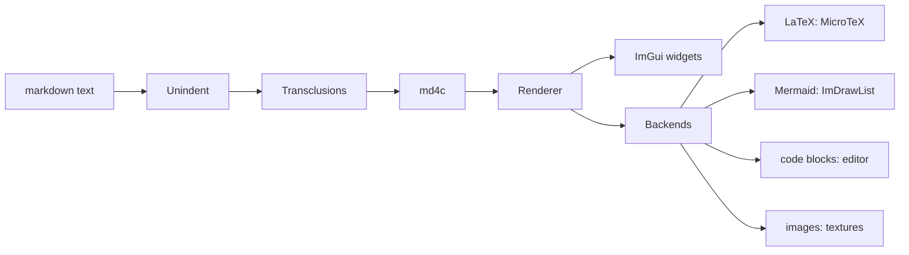
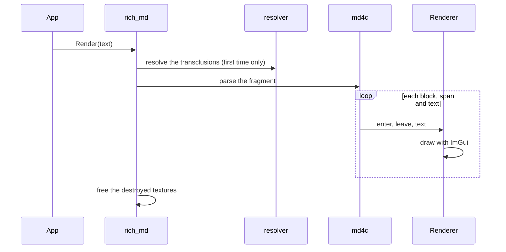
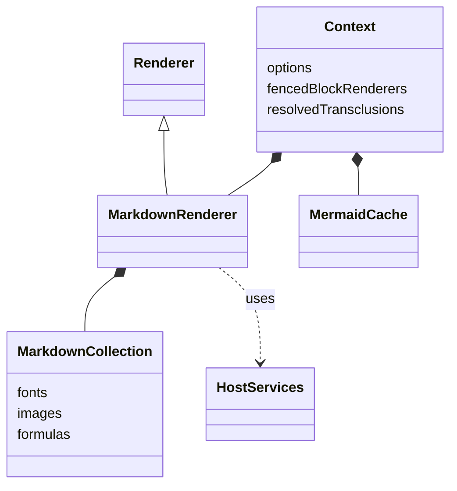

# imgui_rich_md: architecture

How rich_md works, and how its Mermaid backend works, for contributors. Like the [API page](api.md), this page is
assembled from the sources by [narrative programming](narrative_programming/narrative_programming.md) (its source:
[architecture.src.md](architecture.src.md)): its prose and its code come from the files they describe.

## Part 1: how rich_md works

### The pipeline

![[../imgui_rich_md/rich_md.cpp#Rendering a fragment]]
![[../imgui_rich_md/rich_md.cpp#Rendering a fragment#code]]

### One `Render()` call

![[../imgui_rich_md/internal/rich_md_renderer.cpp#Parsing and drawing]]
![[../imgui_rich_md/internal/rich_md_renderer.cpp#Parsing and drawing#code]]

### Contexts and caches

![[../imgui_rich_md/internal/rich_md_internal.h#Context]]
![[../imgui_rich_md/internal/rich_md_internal.h#Context#code]]

### Host services and backends

![[../imgui_rich_md/rich_md_host.h#Host services]]
![[../imgui_rich_md/rich_md.cpp#Default host services]]
![[../imgui_rich_md/rich_md.cpp#Default host services#code]]

The backends are optional, each behind a [build option](../README.md#build-options): without them, formulas show
their source, code blocks are plain text, and URL images are not downloaded.

## Part 2: the Mermaid backend

The supported subset of Mermaid, and how our layout differs from mermaid.js: [docs/mermaid.md](mermaid.md).

### The pipeline

![[../imgui_rich_md/backends/mermaid/mermaid_model.h#Mermaid model and pipeline]]
![[../imgui_rich_md/backends/mermaid/mermaid_model.h#Pipeline]]
![[../imgui_rich_md/backends/mermaid/rich_md_mermaid.h#Mermaid backend]]
![[../imgui_rich_md/backends/mermaid/rich_md_mermaid.h#Entry points]]

### Parsing

![[../imgui_rich_md/backends/mermaid/mermaid_parse.cpp#Parsing]]

### The model

A diagram is a graph (flowcharts and class diagrams, laid out in layers) or a sequence:
![[../imgui_rich_md/backends/mermaid/mermaid_model.h#Diagram]]

### The layout of a graph

![[../imgui_rich_md/backends/mermaid/mermaid_layout.cpp#Layout]]
![[../imgui_rich_md/backends/mermaid/mermaid_layout.cpp#Layout phases]]
![[../imgui_rich_md/backends/mermaid/mermaid_layout.cpp#Layout phases#code]]

#### Rank
![[../imgui_rich_md/backends/mermaid/mermaid_layout.cpp#Rank]]

#### Order
![[../imgui_rich_md/backends/mermaid/mermaid_layout.cpp#Order]]

#### PlaceAcross
![[../imgui_rich_md/backends/mermaid/mermaid_layout.cpp#PlaceAcross]]

#### AssignLanes
![[../imgui_rich_md/backends/mermaid/mermaid_layout.cpp#AssignLanes]]

#### MeasureGaps
![[../imgui_rich_md/backends/mermaid/mermaid_layout.cpp#MeasureGaps]]

#### PlaceAlong
![[../imgui_rich_md/backends/mermaid/mermaid_layout.cpp#PlaceAlong]]

#### RouteEdges
![[../imgui_rich_md/backends/mermaid/mermaid_layout.cpp#RouteEdges]]

#### Mirror
![[../imgui_rich_md/backends/mermaid/mermaid_layout.cpp#Mirror]]

### Drawing

![[../imgui_rich_md/backends/mermaid/mermaid_draw.cpp#Drawing]]

### The tests

![[../tests/mermaid/mermaid_test.cpp#Mermaid test]]
![[../tests/mermaid/mermaid_review.cpp#Mermaid review]]
